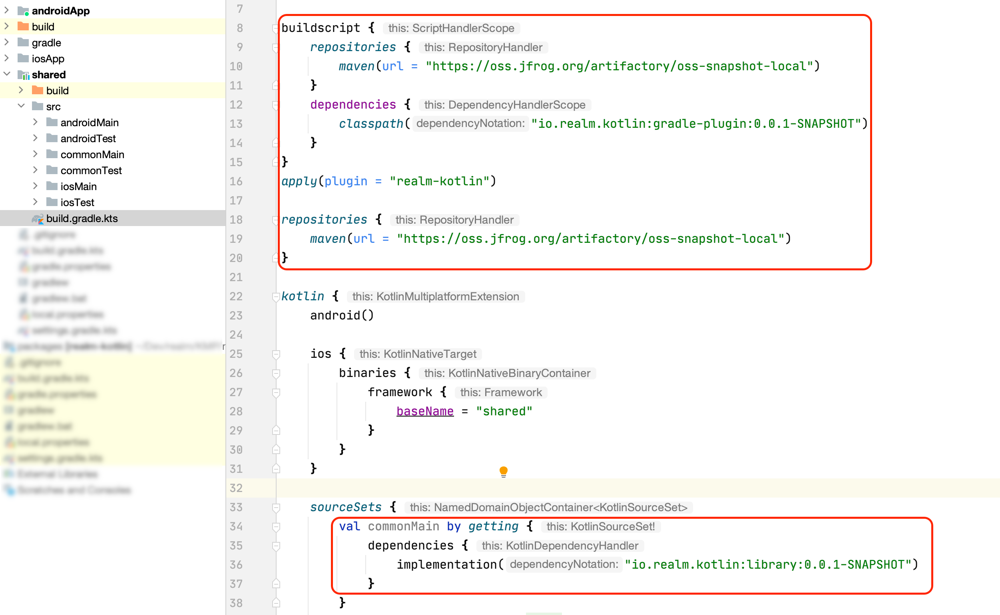

[](https://github.com/realm/realm-kotlin/blob/master/LICENSE)

Realm is a mobile database that runs directly inside phones, tablets or wearables.
This repository holds the source code for the Kotlin SDK for Realm, which runs on Kotlin Multiplatform and Android.

# Quick Startup

## Prerequisite

Start a new [KMM](https://kotlinlang.org/docs/mobile/create-first-app.html) project. 

## Setup

- Add the following Gradle configuration in the *shared* module
`shared/build.gradle.kts`
```Gradle
buildscript {
    repositories {
        maven(url = "https://oss.jfrog.org/artifactory/oss-snapshot-local")
    }
    dependencies {
        classpath("io.realm.kotlin:gradle-plugin:0.0.1-SNAPSHOT")
    }
}
apply(plugin = "realm-kotlin")
```

Specify also the dependency in the common source set
*See [Config.kt](buildSrc/src/main/kotlin/Config.kt#L2txt) for the latest version number.*

```Gradle
repositories {
    maven(url = "https://oss.jfrog.org/artifactory/oss-snapshot-local")
}

kotlin {
  sourceSets {
      val commonMain by getting {
          dependencies {
              implementation("io.realm.kotlin:library:0.0.1-SNAPSHOT")
          }
      }
}
```



- If you're using a version of Kotlin less than 1.5, enable the usage of the new IR backend for the Android project as follow
`androidApp/build.gradle.kts`
```Gradle
android {
  kotlinOptions {
    useIR = true
    jvmTarget = "1.8"
  }
}
```
// screenshot to emphasis

## Define model

Start writing your shared database logic in the shared module by defining first your model

```Kotlin
class Person : RealmObject {
    var name: String = "Foo"
    var dog: Dog? = null
}

class Dog : RealmObject {
    var name: String = ""
    var age: Int = 0
}
```

## Open Database

Define a _RealmConfiguration_ with the database schema, then open the Realm using it.

```Kotlin
val configuration = RealmConfiguration(schema = setOf(Person::class, Dog::class))
```

```Kotlin
val realm = Realm.open(configuration)
```


## Write

Persist some data by instantiating the data objects and copying it into the open Realm instance

```Kotlin
// plain old kotlin object
val person = Person().apply {
    name = "Carlo"
    dog = Dog().apply { name = "Fido"; age = 16 }
}

// persist it in a transaction
realm.beginTransaction()
val managedPerson = realm.copyToRealm(person)
realm.commitTransaction()

// alternatively we can use
realm.beginTransaction()
realm.create<Person>().apply {
            name = "Bar"
            dog = Dog().apply { name = "Filo"; age = 11 }
        }
realm.commitTransaction()
```

## Query

The query language supported by Realm is inspired by Apple’s [NSPredicate](https://developer.apple.com/documentation/foundation/nspredicate), see more examples [here](https://docs.mongodb.com/realm-legacy/docs/javascript/latest/index.html#queries)

```Kotlin
// All Persons
val all = realm.objects<Person>()

// Person named 'Carlo'
val filteredByName = realm.objects<Person>().query("name = $0", "Carlo")

// Person having a dog aged more than 7 with a name starting with 'Fi'
val filteredByDog = realm.objects<Person>().query("dog.age > $0 AND dog.name BEGINSWITH $1", 7, "Fi")
```

## Update

```Kotlin
// Find the first Person without a dog
realm.objects<Person>().query("dog == NULL LIMIT(1)")
    .firstOrNull()
    ?.also { personWithoutDog ->
        // Add a dog in a transaction
        realm.beginTransaction()
        personWithoutDog.dog = Dog().apply { name = "Laika";  age = 3 }
        realm.commitTransaction()
    }
```

## Delete

Use the result of a query to delete from the database
```Kotlin
// delete all Dogs
realm.beginTransaction()
realm.objects<Dog>().delete()
realm.commitTransaction()
```


Next: head to the full KMM [example](./examples/kmm-sample).  

NOTE: The SDK doesn't currently support  `x86` - Please use an `x86_64` or `arm64` emulator/device
 
# Developer Preview

The Realm Kotlin SDK is in Developer Preview. All API's might change without warning and no guarantees are given about stability. *Do not use in production*.  

## Design documents

The public API of the SDK has not been finalized. Design discussions will happen in both Google Doc and this Github repository. Most bigger features will first undergo a design process that might not involve code. These design documents can be found using the following links:

* [Intial Project Description](https://docs.google.com/document/d/10adRFquingm_JgyjDhUzcYXIDJsDG2A1ldFw53GSVJQ/edit)
* [API Design Overview](https://docs.google.com/document/d/1RSPNO95wZAAojYlFwshSpLiuEu9ZqXptO58RDoPHKNc/edit)


# How to build locally:

## Prerequisites

- Swig. On Mac this can be installed using Homebrew: `brew install swig`.

## Commands to build from source

```
git submodule update --init --recursive
cd packages
./gradlew assemble
```
In Android Studio open the `test` project, which will open also the `realm-library` and the compiler projects

You can also run tests from the commandline:

```
cd test
./gradlew connectedAndroidTest
./gradlew macosTest
```

# Using Snapshots

If you want to test recent bugfixes or features that have not been packaged in an official release yet, you can use a **-SNAPSHOT** release of the current development version of Realm via Gradle, available on [JFrog OSS](http://oss.jfrog.org/oss-snapshot-local/io/realm/kotlin/gradle-plugin/)

```
// Global build.gradle
buildscript {
    repositories {
        google()
        jcenter()
        maven {
            url 'http://oss.jfrog.org/artifactory/oss-snapshot-local'
        }
        maven {
            url 'https://dl.bintray.com/kotlin/kotlin-dev'
        }
    }
    dependencies {
        classpath 'io.realm.kotlin:plugin-gradle:<VERSION>'
    }
}

allprojects {
    repositories {
        google()
        jcenter()
        maven {
            url 'http://oss.jfrog.org/artifactory/oss-snapshot-local'
        }
        maven {
            url 'https://dl.bintray.com/kotlin/kotlin-dev'
        }
    }
}
```

See [Config.kt](buildSrc/src/main/kotlin/Config.kt#L2txt) for the latest version number.


# Repository Guidelines

## Branch Strategy

We have three branches for shared development: `master`, `releases` and `next-major`. Tagged releases are only made from `releases`.

`master`:

* Target branch for new features.
* Cotains the latest publishable state of the SDK.
* [SNAPSHOT releases](#using-snapshots) are being created for every commit.

`releases`:

* All tagged releases are made from this branch.
* Target branch for bug fixes.
* Every commit should be merged back to master `master`.
* Minor changes (e.g. to documentation, tests, and the build system) may not affect end users but should still be merged to `releases` to avoid diverging too far from `master` and to reduce the likelihood of merge conflicts.

`next-major`:

* Target branch for breaking changes that would result in a major version bump.


Note: We currently only have the `master` branch, as no tagged releases have been made yet.

## Code Style

We use the offical [style guide](https://kotlinlang.org/docs/reference/coding-conventions.html) from Kotlin which is enforced using [ktlint](https://github.com/pinterest/ktlint) and [detekt](https://github.com/detekt/detekt).

```sh
# Call from root folder to check if code is compliant.
./gradlew ktlintCheck
./gradlew detekt

# Call from root folder to automatically format all Kotlin code according to the code style rules.
./gradlew ktlintFormat
```

Note: ktlint does not allow group imports using `.*`. You can configure IntelliJ to disallow this by going to preferences `Editor > Code Style > Kotlin > Imports` and select "Use single name imports".

## Defining dependencies

All dependency versions and other constants we might want to share between projects are defined inside the file 
`buildSrc/src/main/kotlin/Config.kt`. Any new dependencies should be added to this file as well, so we only have one
location for these.

## Contributing Enhancements

We love contributions to Realm! If you'd like to contribute code, documentation, or any other improvements, please [file a Pull Request](https://github.com/realm/realm-kotlin/pulls) on our GitHub repository. Make sure to accept our [CLA](#CLA)!

This project adheres to the [Contributor Covenant Code of Conduct](https://www.contributor-covenant.org/version/2/0/code_of_conduct/code_of_conduct.md). By participating, you are expected to uphold this code. Please report unacceptable behavior to info@realm.io.

### CLA

Realm welcomes all contributions! The only requirement we have is that, like many other projects, we need to have a [Contributor License Agreement](https://en.wikipedia.org/wiki/Contributor_License_Agreement) (CLA) in place before we can accept any external code. Our own CLA is a modified version of the Apache Software Foundation’s CLA.

[Please submit your CLA electronically using our Google form](https://docs.google.com/forms/d/e/1FAIpQLSeQ9ROFaTu9pyrmPhXc-dEnLD84DbLuT_-tPNZDOL9J10tOKQ/viewform) so we can accept your submissions. The GitHub username you file there will need to match that of your Pull Requests. If you have any questions or cannot file the CLA electronically, you can email help@realm.io.


# Samples

## Kotlin Multiplatform Sample

The folder `examples/kmm-sample` contains an example showing how to use Realm in a multiplatform
project, sharing code for using Realm in the `shared` module. The project is based on
`https://github.com/Kotlin/kmm-sample`.
