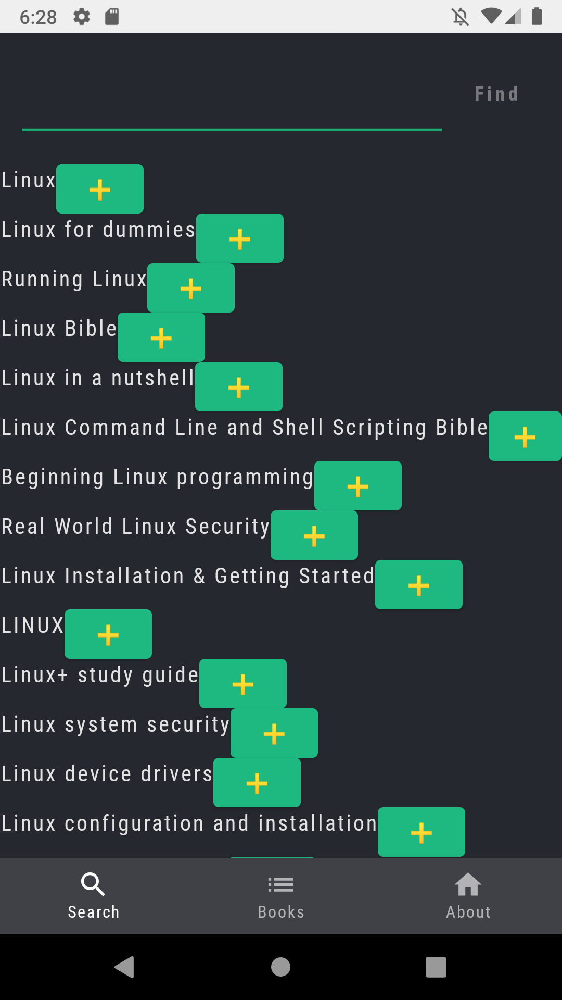
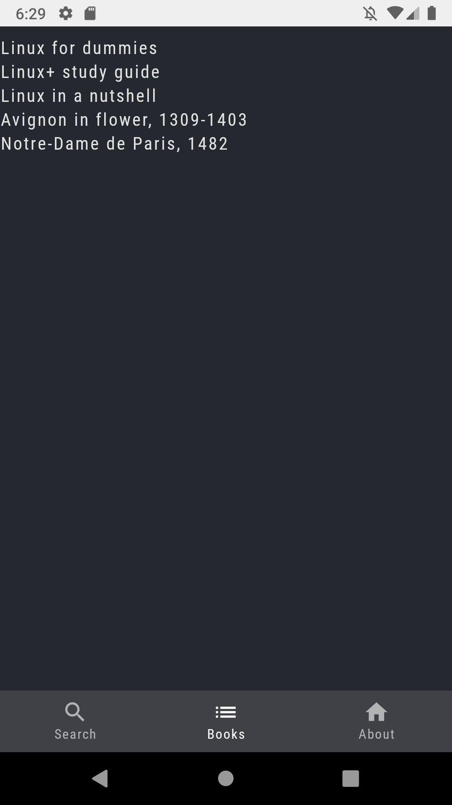
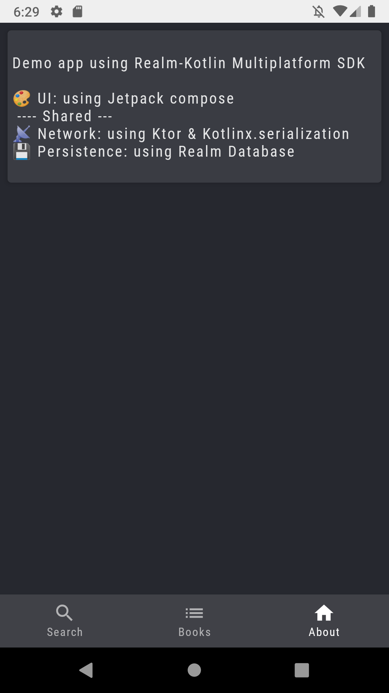
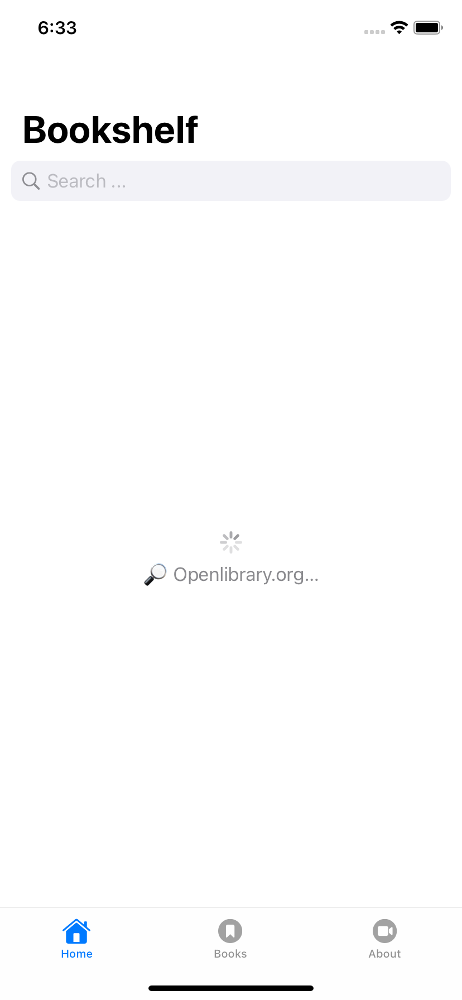
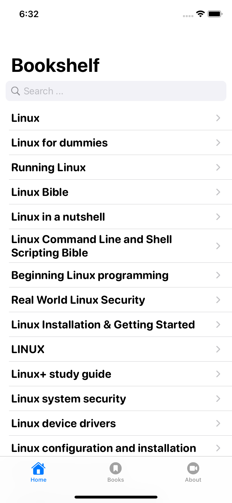
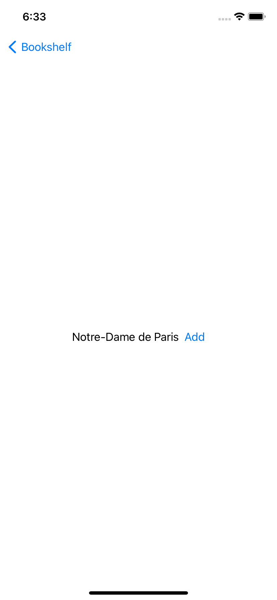
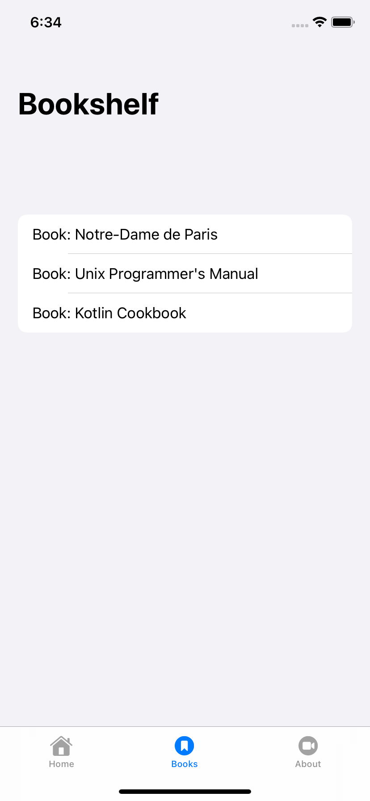
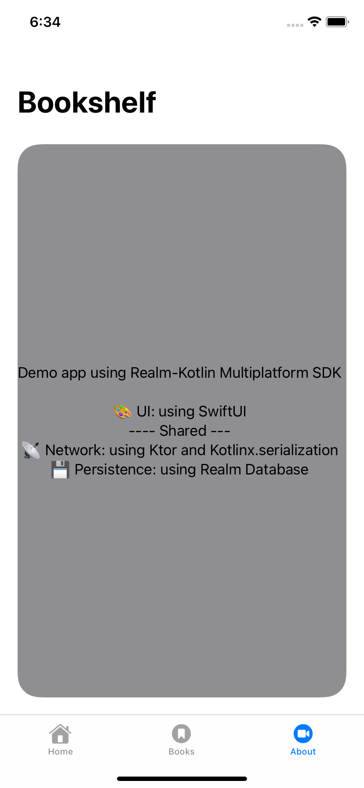

## KMM Sample App using a shared business logic with:

- 📡 Network: using Ktor & Kotlinx.serialization
- 💾 Persistence: using Realm Database

The UI part 🎨 is platform specific:
- 🤖 Android: Jetpack compose
- 🍏 iOS: SwiftUI

## Screenshots:

### Android

### iOS

